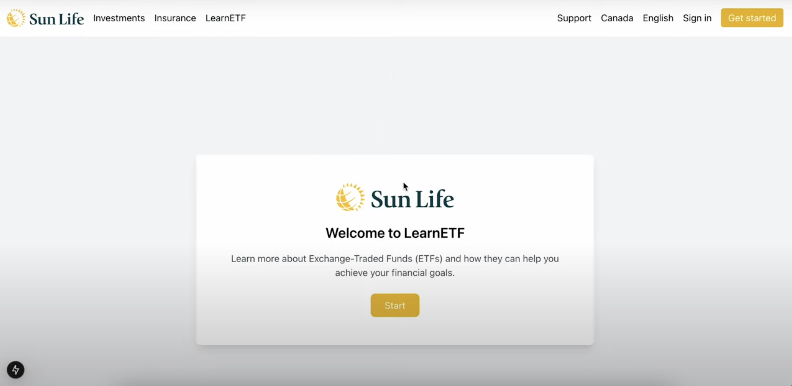

<h1 align="center">
LearnETF 📈
</h1>

LearnETF is an award-winning hackathon project created for the **Sun Life Case** Competition, during Geesehacks designed to empower Gen Z and newer generations with **financial literacy**. This innovative platform provides **interactive modules** to educate users about **ETFs, stocks, mutual bonds, and other investment tools**. By blending advanced technology and engaging content
LearnETF simplifies complex financial concepts, making investing accessible and understandable for younger audiences.

Our project won 2nd place overall for Sun Life's Sponsor Prize.

<hr>


&nbsp;

<h1 align="center">Key Features</h1>
<ul>
    <li>Interactive Learning Modules: Users can explore topics like ETFs, stocks, and bonds through gamified modules designed to enhance engagement and retention.</li>
    <li>Real-Time Market Insights: Using Yahoo Finance (yfinance), NumPy, and pandas, the app provides up-to-date stock data, market trends, and insights.</li>
    <li>AI-Powered Guidance: Integration with the OpenAI API enables personalized content for users to clarify financial concepts and investment strategies.</li>
    <li>Data Visualization: Interactive charts and graphs, powered by Plotly, Cufflinks, and Matplotlib, help users understand financial trends and concepts visually.</li>
    <li>Beginner-Friendly Approach: The platform prioritizes accessibility, breaking down complex jargon into easily digestible lessons tailored for Gen Z.</li>
</ul>

&nbsp;
<h1 align="center">
Tech Stack ⚙️
</h1>

- **Frontend:**
    - Next.js for server-side rendering and optimized web performance.
    - React for building dynamic user interfaces.
    - TypeScript for strong typing and improved development efficiency.
- **Backend:**
    - Python + Flask for a lightweight, scalable backend.
    - OpenAI API for AI-powered personalization based on personal context.
    - Plotly for interactive data visualization.
    - yfinance for fetching stock market data and insights.

## Why LearnETF?

With the rise of retail investing and the importance of financial independence, younger generations need tools to understand investment options and make informed decisions.
LearnETF bridges the knowledge gap by combining cutting-edge technology, real-time data, and AI-powered learning to create a robust educational platform.

The project not only aims to educate but also to empower users with the confidence to navigate the financial world effectively.

## Acknowledgments

This project was built with passion and creativity during the Sun Life Case Competition, where it earned the winning spot. Thanks to GeeseHacks for having us at this event!

The team’s commitment to innovation and the use of a forward-thinking tech stack made this achievement possible.

<hr>

### Contributors

```
- Akram Jamil: akram.jamil@uwaterloo.ca
- Sahil Alamgir: sahil.alamgir@uwaterloo.ca
- Om Nathwani: ornathwa@uwaterloo.ca
- Aaryan Nanda: ak2nanda@uwaterloo.ca
```

<hr>

To run the app: 
1. Intialize backend: 
```bash
cd backend
python -m venv venv
source venv/bin/activate
pip install -r requirements.txt
```

2. Intialize frontend: 
```bash
cd frontend && npm install
cd ..
```
